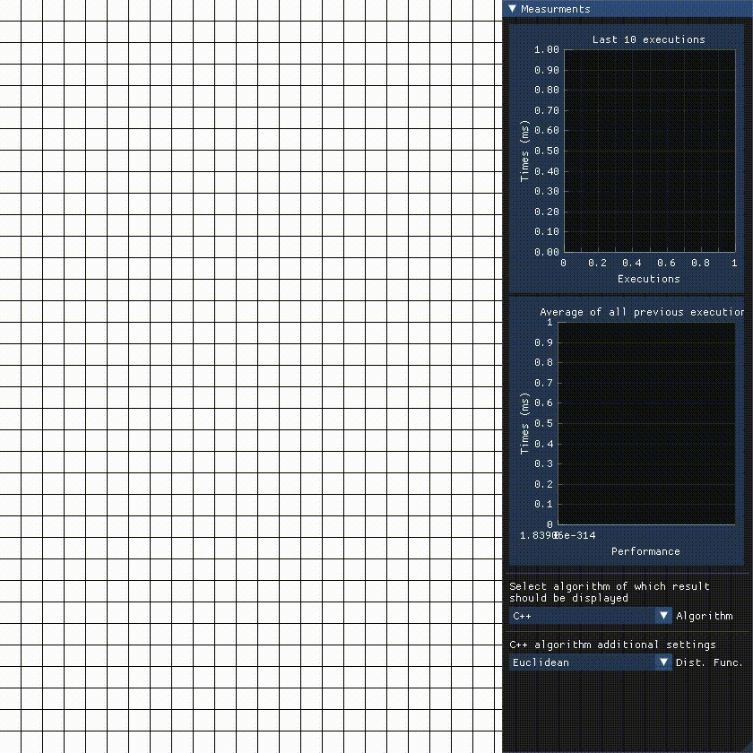

# A* Assembly

Project carried out for project classes of the subject **Assembler Programming Languages**.

A <a href="https://www.youtube.com/watch?v=4xT3xT4s1ls">video</a> showing how the application works

## What is this application about?
The application allows you to the execution time of the A* algorithm for three different implementations: C++17, C++03 and Assembler.

## Libraries used
* [SFML](https://github.com/ocornut/imgui)
* [ImGui](https://github.com/ocornut/imgui)
* [ImGui-SFML](https://github.com/eliasdaler/imgui-sfml)

## Team
- [Dawid Grobert](https://github.com/Notiooo)
- [Julia Boczkowska](https://github.com/JuliaBoczkowska)

